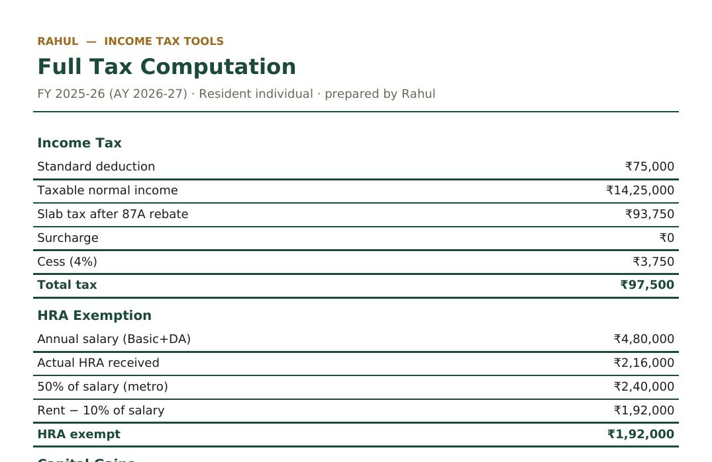

# Income Tax Tools — FY 2025-26 (AY 2026-27)

[](https://YOUR-APP.streamlit.app)


> Replace `YOUR-APP` / `YOUR-USERNAME` above once the repo is pushed and the app is deployed.

### Sample output
A merged computation exported from the **Full Computation Report** page:



_Live-UI screenshot:_ run the app, then `python screenshot.py` (needs `pip install playwright && playwright install chromium`). It saves `docs/screenshot.png` — reference it here with ``.

A multi-page Streamlit site of Indian income-tax tools for resident individuals — calculators plus section-mapper and ITR-1 JSON utilities. Built by Rahul.

| Page | What it does |
|---|---|
| **Income Tax Calculator** | Old vs New regime comparison — slabs, 87A rebate, surcharge (with marginal relief), 4% cess, best-regime + net payable. |
| **HRA Exemption** | Section 10(13A) / Rule 2A — least of actual HRA, 40%/50% of salary, rent − 10% of salary. Old regime only. |
| **Capital Gains** | Post-23-Jul-2024 rates; set-off + **loss carry-forward tracking** (STCL/LTCL rules, 8-year expiry, downloadable schedule). Feeds into the Income Tax page. |

> Estimates for common cases — verify with the official portal / ITR utility before
> filing. The new regime is the default u/s 115BAC; the 87A rebate applies to regular
> income, not special-rate income such as capital gains.


## Wiring & PDF export
- Compute once on the **Capital Gains** tab — the gains are stored in session and can be
  pulled into the **Income Tax** tab via *“Add capital gains on top”*. There they are taxed
  above slab income with the **resident basic-exemption adjustment** (unused basic-exemption
  limit set off against the highest-rate gains first) and capital-gains surcharge capped at 15%.
- Every page has a **⬇ Download computation (PDF)** button. PDFs use the bundled DejaVuSans
  font (in `assets/`) so the ₹ symbol renders correctly.

| **Advance Tax** | Instalment schedule (15/45/75/100%) with a simplified **234C / 234B** interest estimate; can prefill the tax figure from the Income Tax tab. |
| **ITR Form Selector** | Rule-based recommendation across **ITR-1 … ITR-7** from taxpayer type, residence, income heads and restrictions. |
| **Section Mapper** | Income-tax Act **1961 ↔ 2025** section lookup for commonly-cited provisions (partial reference). |
| **ITR-1 Computation Utility** | Reads an uploaded **ITR-1 JSON** into a computation/working paper + PDF (salary + interest; does not generate portal JSON). |
| **ITR-4 Computation Utility** | Reads a presumptive **ITR-4 JSON** (44AD/44ADA) into a computation + P&L working paper + PDF. |
| **Full Computation Report** | Merges the latest Income Tax + HRA + Capital Gains + Advance Tax results into a **single PDF**. |

## Loss carry-forward
The Capital Gains page takes current-year gains/losses and a brought-forward loss schedule
(editable table). Set-off order: 54-series exemption → current-year losses → brought-forward
(oldest first). STCL sets off against STCG and LTCG; LTCL only against LTCG. Unabsorbed losses
carry forward up to 8 assessment years and then lapse; the resulting schedule is shown and
downloadable as CSV. **Persistence across years:** download the schedule at year-end and
re-upload that CSV next year via the *“Prefill from last year's carry-forward CSV”* control to
auto-populate the brought-forward table.

## Project layout
```
Home.py                       # landing page (Streamlit entrypoint)
shared.py                     # styling, ₹ formatting, income-tax engine
pages/
  1_Income_Tax_Calculator.py
  2_HRA_Exemption.py
  3_Capital_Gains.py
  4_Advance_Tax.py
  5_ITR_Form_Selector.py
  6_Section_Mapper.py
  7_ITR1_Computation_Utility.py
  8_ITR4_Computation_Utility.py
  9_Full_Computation_Report.py
tests/test_engine.py          # pytest unit tests (run in CI)
screenshot.py                 # optional: capture a live-UI screenshot (Playwright)
assets/                       # bundled DejaVuSans fonts (for ₹ in PDFs)
requirements.txt
.github/workflows/ci.yml      # byte-compile + engine sanity check on push/PR
```

## Testing
```bash
pip install pytest
pytest tests/ -q
```
CI runs these on every push/PR (byte-compile + unit tests).

## Run locally
```bash
pip install -r requirements.txt
streamlit run Home.py
```
Open http://localhost:8501 — the three tools appear in the left sidebar.

## Push to GitHub
Create an empty **public** repo on GitHub (no README), then:
```bash
git remote add origin https://github.com/<your-username>/income-tax-tools.git
git push -u origin main
```
(This bundle already has a commit on `main`.)

## Deploy free on Streamlit Community Cloud
1. Go to https://share.streamlit.io and sign in with GitHub.
2. **Create app → Deploy a public app from GitHub**.
3. Repo: yours · Branch: `main` · **Main file path: `Home.py`** → **Deploy**.
4. You get a public URL like `https://<your-app>.streamlit.app`.
